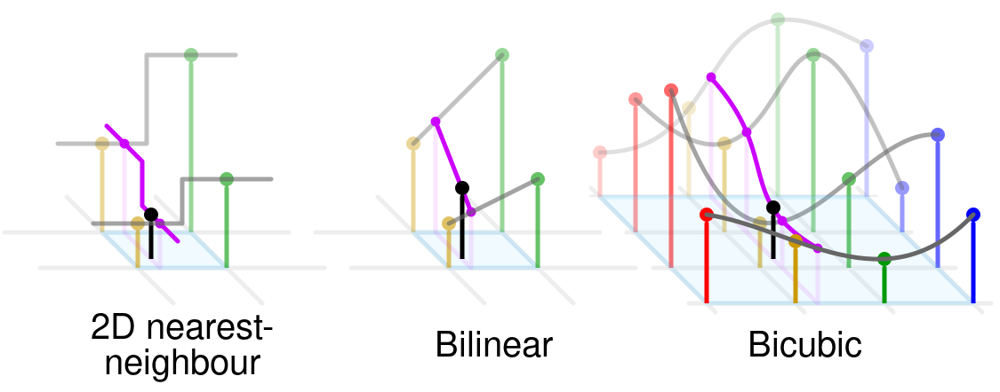

# Interpolation methods

This project has several interpolation methods implemented. It includes:
- Nearest neighbour interpolation
- Bilinear interpolation
- Bicubic interpolation



## Nearest neighbour interpolation

This method is used for multidimensional interpolation. Selects the value of the nearest point and does not consider the values of neighboring points at all.

### Implementation

``` {eval-rst}
.. autofunction:: interpolation.methods.nearest_neighbour_interpolation
```

## Bilinear interpolation

This method is used for interpolating functions of two variables (e.g., x and y) using repeated linear interpolation. It is usually applied to functions sampled on a 2D rectilinear grid.

Suppose you have a rectangular grid with points $(x_1, y_1)$, $(x_2, y_1)$, $(x_1, y_2)$, $(x_2, y_2)$, and you want to estimate the value at point $(x, y)$ where $x_1 \leq x \leq x_2$ and $y_1 \leq y \leq y_2$. The known values at these points are:

- $f(x_1,y_1) = Q_{11}$
- $f(x_2,y_1) = Q_{21}$
- $f(x_1,y_2) = Q_{12}$
- $f(x_2,y_2) = Q_{22}$

Then, 

$$ f(x, y) = \frac{(x_2 - x)(y_2 - y)}{(x_2 - x_1)(y_2 - y_1)}Q_{11} + \frac{(x - x_1)(y_2 - y)}{(x_2 - x_1)(y_2 - y_1)}Q_{21} + \\
\frac{(x_2 - x)(y - y_1)}{(x_2 - x_1)(y_2 - y_1)}Q_{12} + \frac{(x - x_1)(y - y_1)}{(x_2 - x_1)(y_2 - y_1)}Q_{22}. $$

### Implementation

``` {eval-rst}
.. autofunction:: interpolation.methods.bilinear_interpolation
```

## Bicubic interpolation

Suppose the function values $f$ and the derivatives $f_x$, $f_y$ and $f_{xy}$ are known at the four corners $(0, 0)$, $(1, 0)$, $(0, 1)$, and $(1, 1)$ of the unit square. The interpolated surface can then be written as

$$p(x, y) = \sum_{i=0}^{3} \sum_{j=0}^{3} a_{ij}x^i y^j.$$

The interpolation problem consists of determining the 16 coefficients $a_{ij}$. Matching $p(x, y)$ with the function values yields four equations:

1. $f(0, 0) = p(0, 0) = a_{00}$,

2. $f(1, 0) = p(1, 0) = a_{00} + a_{10} + a_{20} + a_{30}$,

3. $f(0, 1) = p(0, 1) = a_{00} + a_{01} + a_{02} + a_{03}$,

4. $f(1, 1) = p(1, 1) = \sum_{i=0}^{3} \sum_{j=0}^{3} a_{ij}$.

Likewise, eight equations for the derivatives in the $x$ and the $y$ directions:

1. $f_x(0, 0) = p_x(0, 0) = a_{10}$,

2. $f_x(1, 0) = p_x(1, 0) = a_{10} + 2a_{20} + 3a_{30}$,

3. $f_x(0, 1) = p_x(0, 1) = a_{10} + a_{11} + a_{12} + a_{13}$,

4. $f_x(1, 1) = p_x(1, 1) = \sum_{i=1}^{3} \sum_{j=0}^{3} a_{ij} i$,

5. $f_y(0, 0) = p_y(0, 0) = a_{01}$,

6. $f_y(1, 0) = p_y(1, 0) = a_{01} + a_{11} + a_{21} + a_{31}$,

7. $f_y(0, 1) = p_y(0, 1) = a_{01} + 2a_{02} + 3a_{03}$,

8. $f_y(1, 1) = p_y(1, 1) = \sum_{i=0}^{3} \sum_{j=1}^{3} a_{ij} j$.

And four equations for the $xy$ mixed partial derivative:

1. $f_{xy}(0, 0) = p_{xy}(0, 0) = a_{11}$,

2. $f_{xy}(1, 0) = p_{xy}(1, 0) = a_{11} + 2a_{21} + 3a_{31}$,

3. $f_{xy}(0, 1) = p_{xy}(0, 1) = a_{11} + 2a_{12} + 3a_{13}$,

4. $f_{xy}(1, 1) = p_{xy}(1, 1) = \sum_{i=1}^{3} \sum_{j=1}^{3} a_{ij} i j$.

The expressions above have used the following identities:

$$p_{x}(x,y) = \sum_{i=1}^{3} \sum_{j=0}^{3} a_{ij} i x^{i-1} y^j,$$

$$p_{y}(x,y) = \sum_{i=0}^{3} \sum_{j=1}^{3} a_{ij} x^i j y^{j-1},$$

$$p_{xy}(x,y) = \sum_{i=1}^{3} \sum_{j=1}^{3} a_{ij} i x^{i-1} j y^{j-1}.$$

### Implementation

``` {eval-rst}
.. autofunction:: interpolation.methods.bicubic_interpolation
```